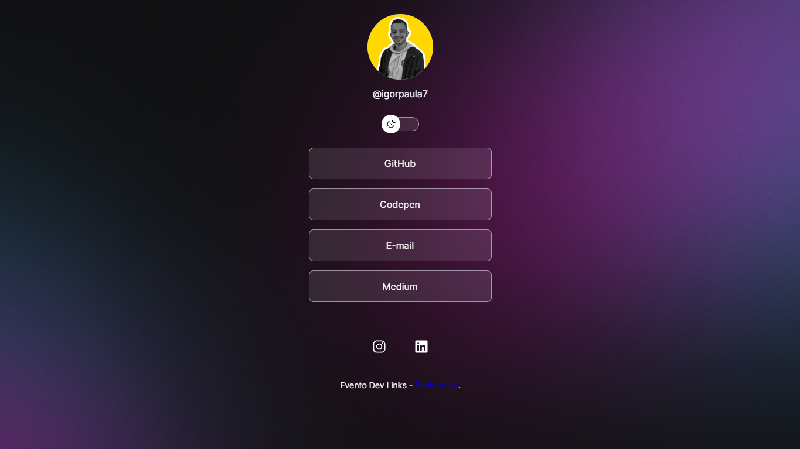

<h1 style="font-size:36px;">Dev Links</h1>

<em>Um evento Rocketseat</em>

O Dev Links é um evento com carga horária de 5 horas, onde é desenvolvido um agregador de links, parecido com um Linktree. Nesse evento, foram abordados os seguintes conteúdos:

<ul>
  <li>HTML 5</li>
  <li>CSS 3</li>
  <li>Media Queries</li>
  <li>Theme Switch</li>
  <li>JavaScript</li>
</ul>

<em>Resultados:</em>

  
  
<em>Dark-mode Mobile</em>

  
    
<em>Light-mode Mobile</em>

<em>Dark-mode Desktop</em>

<em>Light-mode Desktop</em>

